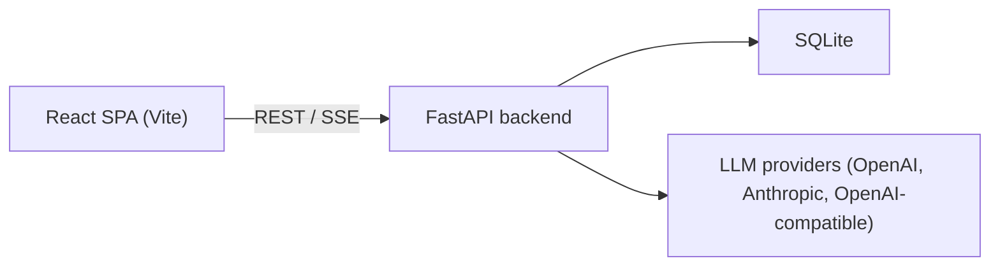

# Prompt Injection Protection Platform

An educational web app for exploring prompt-injection vulnerabilities, understanding mitigations, and testing LLM systems against injection attacks. Built with React + FastAPI.

## Architecture



The **frontend** is a single-page React app covering vulnerabilities, mitigations, a testing workbench, a prompt enhancer, and an AI security assistant. The **backend** is a FastAPI service that persists tests, proxies LLM calls, and analyses results.

## Prerequisites

- Node.js >= 18 and npm (or pnpm)
- Python >= 3.10

## Quick start

```bash
# Backend
cd backend
python -m venv .venv && source .venv/bin/activate
pip install -e ".[dev]"
cp .env.example .env   # fill in your API keys
PYTHONPATH=src uvicorn main:app --reload --port 8080

# Frontend (separate terminal)
cd frontend
npm install
npm run dev
```

Frontend runs at http://localhost:5173, backend at http://localhost:8080 (Swagger docs at `/docs`).

See [frontend/README.md](frontend/README.md) and [backend/README.md](backend/README.md) for full details.

## Project structure

```
├── frontend/               → React + Vite + Tailwind + shadcn/ui
│   └── src/app/
│       ├── pages/          # One file per route
│       ├── data/           # Static catalogue (vulnerabilities, mitigations, test presets)
│       ├── components/ui/  # shadcn/ui primitives
│       ├── api/            # API client functions
│       ├── assistant/      # Chat widget + streaming client
│       ├── types/          # Shared TypeScript types
│       └── lib/pdf/        # PDF export templates
│
├── backend/                → FastAPI + SQLite
│   └── src/
│       ├── main.py         # Entry point
│       ├── api/            # Routes + Pydantic schemas
│       ├── app/            # Application services
│       ├── domain/         # Core domain (providers, tests, knowledge base)
│       └── infra/          # Config, DB, LLM providers, test runners
```
