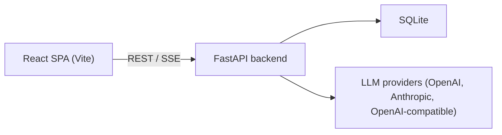

## Prompt Injection Protection Platform

An educational web app for exploring prompt‑injection vulnerabilities, understanding mitigations, and testing LLM systems against injection attacks. Built with React and FastAPI.

### Architecture



- **Frontend**: Single‑page React app.
  - Vulnerability catalogue and details.
  - Mitigations library.
  - Testing workbench for running prompts against LLMs.
  - Prompt enhancer tool.
  - Security knowledge assistant (chat).
- **Backend**: FastAPI service.
  - Stores tests and prompt enhancements in SQLite.
  - Routes all LLM calls through a provider router.
  - Analyses responses for injection risk.

### Prerequisites

- Node.js ≥ 18 (npm or pnpm)
- Python ≥ 3.10

### Quick start

```bash
# Backend
cd backend
python -m venv .venv && source .venv/bin/activate   # Windows: .venv\Scripts\activate
pip install -e ".[dev]"
cp .env.example .env   # fill in your Azure AI Foundry endpoints and API keys
PYTHONPATH=src uvicorn main:app --reload --port 8080

# Frontend (separate terminal)
cd frontend
npm install
npm run dev    # http://localhost:5173
```

- Backend REST + docs: http://localhost:8080 (Swagger at `/docs`)
- Frontend SPA: http://localhost:5173
- Default API base: `http://localhost:8080/api` (configurable via `VITE_API_BASE`).

### Project structure

```text
.
├── frontend/               → React + Vite + Tailwind + shadcn/ui
│   └── src/app/
│       ├── pages/          # One component per route
│       ├── data/           # Vulnerabilities, mitigations, test presets
│       ├── components/ui/  # shadcn/ui primitives
│       ├── api/            # API client functions
│       ├── assistant/      # Chat widget + streaming client
│       ├── types/          # Shared TypeScript types
│       └── lib/pdf/        # PDF export templates
│
├── backend/                → FastAPI + SQLite
│   └── src/
│       ├── main.py         # FastAPI app entry point
│       ├── container.py    # Dependency injection wiring
│       ├── api/            # Routes + Pydantic schemas
│       ├── app/            # Application services
│       ├── domain/         # Core domain (providers, tests, knowledge, prompt)
│       └── infra/          # Config, DB, providers, runners, analyzers
│
├── FEATURES.md             # Extra UX / feature highlights
└── backend/ARCHITECTURE.md # Backend internals and flows
```

### Key flows

- **Testing a prompt**
  - User configures a test in the frontend testing page.
  - Frontend calls `POST /api/tests` and then `POST /api/tests/:id/run`.
  - Backend resolves model and runner, applies mitigations, calls the LLM, runs analysis, and stores results.
  - Frontend displays test runs and risk scores.

- **Prompt enhancement**
  - User submits a system prompt and selects mitigations.
  - Frontend calls `POST /api/prompt‑enhancements`.
  - Backend runs the three‑stage pipeline (improve → prepend mitigations → verify) and stores the final result.
  - Frontend shows original, improved, and enhanced prompts with verdict.

- **Security assistant chat**
  - User opens the chat and sends a question.
  - Frontend opens an SSE stream to `POST /api/chat`.
  - Backend searches the knowledge base, augments the message, calls the LLM, and streams tokens back.

For more detail:

- Frontend: see `frontend/README.md`.
- Backend: see `backend/README.md` and `backend/ARCHITECTURE.md`.
